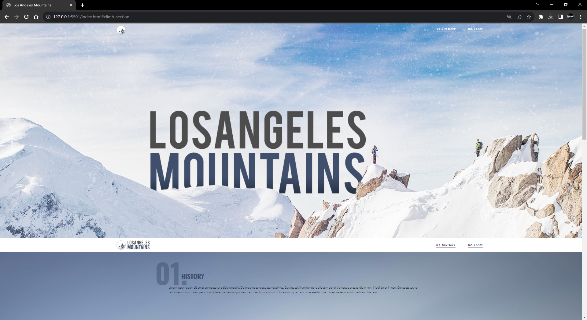

# Los Angeles Mountains

## Description

I completed a PSD to HTML conversion project, where I received a design file and extracted the necessary images. The project's requirements included ensuring the website's full responsiveness. Specifically, I implemented a responsive carousel using a snippet from bootsnipp.com, and for mobile screens, I utilized Bootstrap to transform the carousel into an accordion, providing an optimal viewing experience across various devices.

[Link to LIVE Site](#)

## Table of Contents

[Technologies](#technologies) 
[Usage](#usage) 
[Credits](#credits) 

---

## Technologies

- HTML
- CSS
- JavaScript
- Bootstrap

## Usage

## Credits

Omar Mousa
